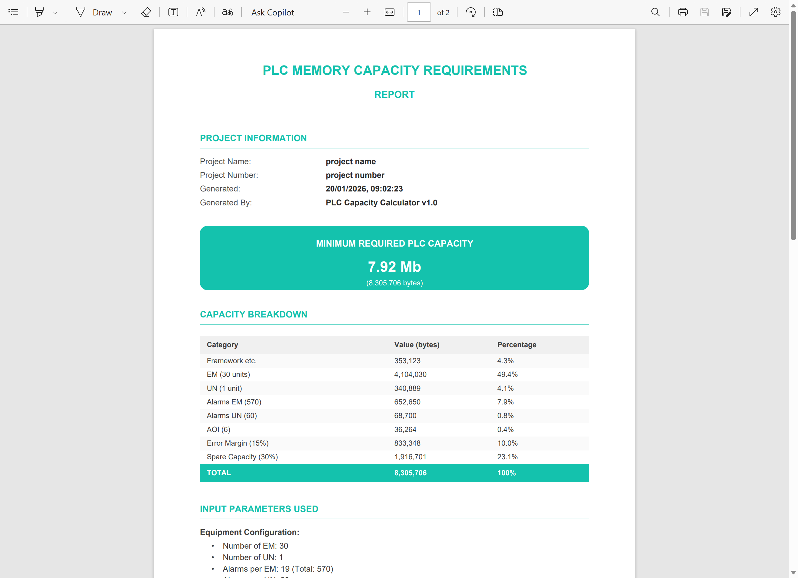

# ⚡ PLC Capacity Calculator

<div align="center">


**A professional Progressive Web App for calculating PLC memory capacity requirements in industrial automation projects.**

[Features](#-features) • [Installation](#-installation) • [Usage](#-usage) • [Screenshots](#-screenshots) • [Documentation](#-documentation)

</div>

---

## 📋 Overview

PLC Capacity Calculator is a lightweight, offline-capable web application designed for controls engineers and electrical designers. It helps determine the minimum PLC memory requirements based on equipment modules, alarms, and safety margins — essential for accurate PLC procurement and system design.

Built with vanilla JavaScript and no external frameworks, this tool runs entirely in the browser and can be installed as a desktop application on Windows, macOS, and Linux.

---

## ✨ Features

| Feature | Description |
|---------|-------------|
| 🔢 **Real-time Calculations** | Instant updates as you modify input parameters |
| 📊 **Visual Breakdown** | Interactive treemap chart showing capacity distribution |
| 📄 **PDF Reports** | Generate professional reports for procurement teams |
| 💾 **Export/Import** | Save and share calculations as JSON files |
| 📱 **PWA Support** | Install as a native-like desktop app (when served via HTTP/HTTPS) |
| 🔌 **Offline Mode** | Full offline capability with service worker caching |
| 💽 **Auto-save** | Automatically persists data to local storage |
| 🎨 **Dark Theme** | Modern, eye-friendly dark interface |

---

## 🖼️ Screenshots

### Main Interface
<!-- Replace with actual screenshot -->
<div align="center">

</div>

<p align="center"><em>Clean, professional interface with real-time calculations and visual feedback</em></p>

---

### Capacity Breakdown Chart
<!-- Replace with actual screenshot -->
<div align="center">

</div>

<p align="center"><em>Interactive treemap visualisation of memory allocation by category</em></p>

---

### PDF Report Generation
<!-- Replace with actual screenshot -->
<div align="center">

</div>

<p align="center"><em>Professional PDF reports ready for procurement and documentation</em></p>

---

## 🚀 Installation

### Option 1: Quick Start (Local File)
Simply open `index.html` in a modern web browser. No server required.

```bash
# Clone the repository
git clone https://github.com/yourusername/plc-capacity-calculator.git
cd plc-capacity-calculator

# Open index.html directly in your browser
# Double-click index.html or drag it to your browser
```

**Note:** When using this method, PWA install features are not available, but all core functionality works perfectly.

### Option 2: Install as Desktop App (PWA)

To enable PWA installation and full offline support, you must serve the app via HTTP/HTTPS:

**Using Python (Built-in):**
```bash
# Python 3
python -m http.server 8000

# Then open: http://localhost:8000
```

**Using Node.js:**
```bash
# Install http-server globally
npm install -g http-server

# Run server
http-server -p 8000

# Then open: http://localhost:8000
```

**Installing as Desktop App:**
1. Open the application at `http://localhost:8000` in **Chrome** or **Edge**
2. Click the install icon (⊕) in the browser's address bar
3. The app will be added to your desktop/start menu with full offline support

> **Why a server is needed:** PWA features (install prompt, service workers, offline caching) require the app to be served via HTTP/HTTPS due to browser security policies. Simply opening `index.html` as a file:// URL disables these features.

---

## 📖 Usage

### Input Parameters

| Parameter | Description | Default |
|-----------|-------------|---------|
| **EM** | Number of Equipment Modules | 6 |
| **UN** | Number of Units | 1 |
| **Alarms per EM** | Alarm count per Equipment Module | 19 |
| **Alarms per UN** | Alarm count per Unit | 60 |
| **AOI** | Number of Add-On Instructions | 6 |
| **Percentage Error** | Safety margin for calculation errors | 15% |
| **Spare Capacity** | Additional capacity for future expansion | 30% |

### Constants (Editable)

These represent memory consumption per unit and can be adjusted based on your specific PLC configuration:

| Constant | Description | Default (bytes) |
|----------|-------------|-----------------|
| **Framework** | Base framework memory | 353,123 |
| **EM** | Memory per Equipment Module | 136,801 |
| **UN** | Memory per Unit | 340,889 |
| **Alarms EM** | Memory per EM alarm | 1,145 |
| **Alarms UN** | Memory per UN alarm | 1,145 |
| **AOI** | Memory per Add-On Instruction | 6,044 |

### Calculation Formula

```
Subtotal = Framework + (EM × EM_count) + (UN × UN_count) + 
           (Alarms_EM × Total_EM_Alarms) + (Alarms_UN × UN_Alarms) + 
           (AOI × AOI_count)

With Error = Subtotal × (1 + Error%)
Total = With_Error × (1 + Spare%)
Result (Mb) = Total ÷ 1,048,576
```

---

## 📁 File Operations

### Export Data
Click **"Export Data"** to save your calculation as a JSON file. Perfect for:
- Sharing configurations with colleagues
- Backing up project calculations
- Version controlling your estimates

**File format:** `PLC_Calc_{ProjectNumber}_{Date}.json`

### Import Data
Click **"Import Data"** to load a previously saved calculation. The app validates the file structure before importing.

### Generate PDF Report
Click **"Generate PDF Report"** to create a professional document including:
- Project information
- Capacity requirements summary
- Detailed breakdown table
- Input parameters used
- Constants reference
- Procurement recommendations

**File format:** `PLC_Capacity_Report_{ProjectNumber}_{Date}.pdf`

> **Note:** Project Name and Project Number are required to generate a PDF report.

---

## ⌨️ Keyboard Shortcuts

| Shortcut | Action |
|----------|--------|
| `Ctrl/Cmd + S` | Export data to JSON |
| `Ctrl/Cmd + O` | Import data from JSON |
| `Ctrl/Cmd + P` | Generate PDF report |
| `Esc` | Close modal dialogs |

---

## 🛠️ Technical Details

### Technology Stack

- **Frontend:** HTML5, CSS3, Vanilla JavaScript (ES6+)
- **Charts:** [Chart.js](https://www.chartjs.org/) with Treemap plugin
- **PDF Generation:** [jsPDF](https://github.com/parallax/jsPDF)
- **PWA:** Service Worker + Web App Manifest

### Browser Support

| Browser | Version |
|---------|---------|
| Chrome | 80+ |
| Edge | 80+ |
| Firefox | 75+ |
| Safari | 13+ |

### File Structure

```
plc-capacity-calculator/
├── index.html          # Main application
├── styles.css          # Application styles
├── app.js              # Core logic & calculations
├── sw.js               # Service Worker (offline support)
├── manifest.json       # PWA manifest
├── icons/
│   ├── icon-192.png    # App icon (192×192)
│   └── icon-512.png    # App icon (512×512)
└── README.md           # This file
```

---

## 🔧 Customisation

### Modifying Default Values

Edit the `DEFAULT_VALUES` object in `app.js`:

```javascript
const DEFAULT_VALUES = {
  inputs: {
    inputEM: 6,
    inputUN: 1,
    alarmsPerEM: 19,
    // ... modify as needed
  },
  constants: {
    constFramework: 353123,
    constEM: 136801,
    // ... modify as needed
  }
};
```

### Changing Theme Colours

Edit the CSS variables in `styles.css`:

```css
:root {
  --bg-primary: #1a1a2e;
  --accent-primary: #15C1AD;
  /* ... modify as needed */
}
```

---

## 🤝 Contributing

Contributions are welcome! Please feel free to submit a Pull Request.

1. Fork the repository
2. Create your feature branch (`git checkout -b feature/AmazingFeature`)
3. Commit your changes (`git commit -m 'Add some AmazingFeature'`)
4. Push to the branch (`git push origin feature/AmazingFeature`)
5. Open a Pull Request

---

## 📄 Licence

This project is licensed under the MIT Licence - see the [LICENSE](LICENSE) file for details.

---

## 🙏 Acknowledgements

- [Chart.js](https://www.chartjs.org/) - Beautiful charts
- [jsPDF](https://github.com/parallax/jsPDF) - PDF generation
- Controls engineers everywhere who inspired this tool

---

<div align="center">

**Made with ⚡ for the automation community**

[Report Bug](https://github.com/yourusername/plc-capacity-calculator/issues) • [Request Feature](https://github.com/yourusername/plc-capacity-calculator/issues)

</div>
